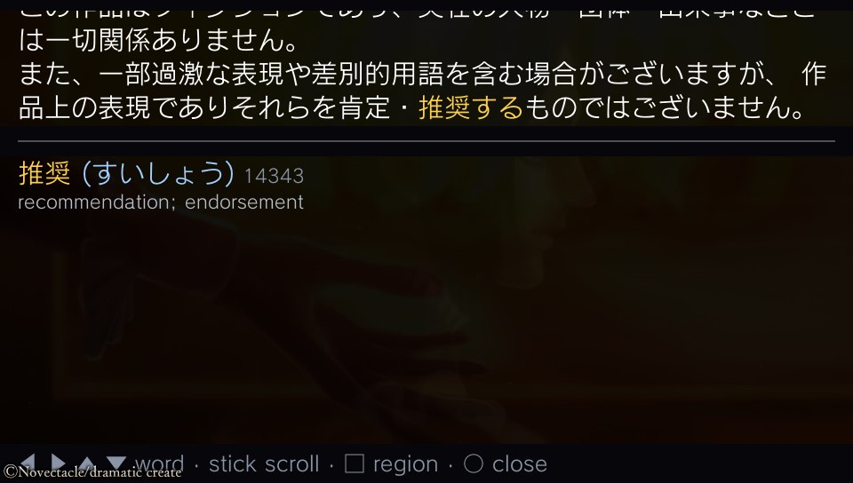

# Vita JP Overlay with local dictionaries and Hachidori Relay

This [bee-san fork](https://github.com/bee-san/vita-jp-overlay) of
[Dartv/vita-jp-overlay](https://github.com/Dartv/vita-jp-overlay) uses your
[Hachidori](https://github.com/bee-san/hachidori) dictionaries through
[Hachidori Relay](https://github.com/bee-san/hachidori-anki) by default.
It also supports **locally installed Yomitan dictionaries** with bounded-memory,
disk-backed lookup. See [Local dictionaries](docs/local-dictionaries.md).
Text recognition still uses Google Lens. Jiten and JPDB remain optional backends.
No dictionary API key is needed for Hachidori.

The idea comes from [meikidroid](https://github.com/rtr46/meikidroid)



## Requirements

- A PS Vita on firmware 3.60 to 3.74 with HENkaku Ensō or h-encore.
- Wi-Fi.
- For local dictionaries: a computer with Python 3.9+ to convert dictionary ZIPs
  once, then copy the resulting files to the Vita. The computer can be off while playing.
- For Hachidori Relay: a computer running Anki with Hachidori Relay v0.0.4 or newer,
  and a current Hachidori browser extension with dictionaries and network sharing enabled.
- An API key only if you explicitly select the optional Jiten or JPDB backend.

## Installing

### From the release zip

1. Download the **VitaJPOverlay** artifact from a successful run in this fork's
   [Actions](https://github.com/bee-san/vita-jp-overlay/actions) page. Extract the
   artifact wrapper to get `VitaJPOverlay-<version>.zip`, then extract that zip.
   Upstream release zips do not contain this fork's local or Hachidori backends.
2. Copy the zip's `ur0` folder to the root of `ur0:` on the Vita. VitaShell's FTP server or
  USB mode both work. You should end up with:
  - `ur0:tai/VitaJPOverlay_Kernel.skprx`
  - `ur0:tai/VitaJPOverlay_Shell.suprx`
  - `ur0:data/VitaJPOverlay/vitajpoverlay.rco`
3. Open `ur0:tai/config.txt` (or `ux0:tai/config.txt`, if that is the one your taiHEN uses) and
  add two lines:
  - `ur0:tai/VitaJPOverlay_Kernel.skprx` on a new line under `*KERNEL`
  - `ur0:tai/VitaJPOverlay_Shell.suprx` on a new line under `*main`
4. Copy the zip's `config.ini` to `ux0:data/VitaJPOverlay/config.ini`. Keep
   `dictionary = hachidori` and set `hachidori_host` to your computer's LAN IP
   as described below. The file is read each time the overlay opens, so later
   changes need no reboot.
5. Reboot.

To update, copy the new files over the old ones and power-cycle the Vita. Your `config.ini`
stays as it is.

### From a computer, over FTP

If you have the source and a built copy of the plugins, `tools/install_ftp.sh` does the
steps above in one go. It needs bash, curl and python3 (macOS or Linux). Start VitaShell's FTP
server (press Select in VitaShell) and run the example below, replacing
`192.168.1.20` with your computer's LAN IP and `192.168.1.30` with the Vita's:

```bash
tools/install_ftp.sh --set dictionary=hachidori --set hachidori_host=192.168.1.20 192.168.1.30
```

It backs up and patches the taiHEN config files, uploads the plugins and writes `config.ini`.
Running it again later keeps your settings. `--uninstall` removes the plugin lines and
`--status` prints the plugin logs.

## Local dictionary setup

Convert a Yomitan term dictionary ZIP on your computer:

```sh
python3 tools/convert_dictionary.py Jitendex.zip -o main.vjdict
```

Copy `main.vjdict` to `ux0:data/VitaJPOverlay/dictionaries/`, then set:

```ini
dictionary = local
local_dictionaries = main.vjdict
```

You can enable up to eight dictionary files or combine multiple ZIPs. The
converter and FTP installer are included in the fork's build ZIP. See the
[installation guide and memory limits](docs/local-dictionaries.md).
Dictionary lookup needs no computer or internet; **Google Lens OCR still needs
internet**. The existing Hachidori Relay default is preserved until you select
`local` (or use `tools/install_dictionary.py --enable`).

The current converter builds a page-based hash index that reduces sentence
lookup reads by 96–97% in the [Jitendex benchmark](docs/lookup-performance.md),
within the existing 112 KiB lookup budget. If you installed the first local
build, update the plugin and reconvert your ZIPs to benefit. Existing `.vjdict`
files remain compatible.

## Hachidori Relay setup

1. On your computer, install a current [Hachidori browser extension](https://github.com/bee-san/hachidori)
   and add the dictionaries you want to use.
2. In Anki, install [Hachidori Relay v0.0.5](https://github.com/bee-san/hachidori-anki/releases/download/v0.0.5/hachidori-relay.ankiaddon),
   restart Anki, and keep it and the browser open.
3. In Hachidori's **Settings → Sharing**, enable **Also with my other computers**.
   Use the home-network address it shows. Your Vita must be able to reach that
   computer on the same trusted network, and its firewall must allow the API port.
4. Set the Vita's `ux0:data/VitaJPOverlay/config.ini`:

   ```ini
   dictionary = hachidori
   hachidori_host = 192.168.1.20
   ```

   Replace `192.168.1.20` with your computer's address. An optional port selects
   a changed `yomitan_api_port`, for example `192.168.1.20:19634`.

This backend uses the relay's **HTTP Yomitan API on port 19633**, not its
WebSocket port 8771 or AnkiConnect's port 8765. It needs no API key. The relay
asks your running Hachidori host for definitions; it does not have its own
copy of the dictionaries. A Tailscale address only works if the Vita's network
is routed into your tailnet; the normal setup uses the computer's LAN address.

The relay has no authentication and this connection is plain HTTP. Do not
expose it to the internet or enable network sharing on untrusted Wi-Fi.
Google Lens OCR still needs internet access and receives the selected screen crop.

The overlay chooses the host's first result at each word position. Inflected
forms use the host's original matched length for highlighting. Dictionary
structured content is reduced to text for the Vita, not rendered as HTML or
images. Existing Anki mining still uses AnkiConnect and the Vita's `anki_*`
settings below; it does not adopt Hachidori's Anki Templates automatically.

Existing upstream configurations keep their selected dictionary when updated.
To switch them, explicitly set `dictionary = hachidori` and `hachidori_host`.

## Using it

In a game:


| Input      | Action                                                                                                        |
| ---------- | ------------------------------------------------------------------------------------------------------------- |
| L + R      | Open or close the overlay (`toggle_button`).                                                                  |
| Select + R | Subtitles on or off (`subtitle_button`): the recognized text in a strip at the top, updated as the game runs. |


In the overlay:


| Button           | Action                                                                                                                                       |
| ---------------- | -------------------------------------------------------------------------------------------------------------------------------------------- |
| ◀ ▶              | Previous or next word. The word is highlighted in the text and its definition is shown below.                                                |
| ▲ ▼              | The word on the line above or below.                                                                                                         |
| Either stick     | Scroll a long definition.                                                                                                                    |
| ×                | Save the selected word to the offline Anki queue (see [Anki](#anki)); no network needed. |
| △                | Send the saved queue to AnkiConnect on your computer. |
| □                | Choose the area to read in this game. Drag a box on the touchscreen, then press × to keep it or ○ to cancel. Holding □ sets the full screen. |
| ○, or the toggle | Close the overlay.                                                                                                                           |

Works with PSP games in Adrenaline. They all share one OCR region, because every PSP game runs inside the same emulator app.


## Settings

All settings live in `ux0:data/VitaJPOverlay/config.ini`. The area to read (□ in the overlay) is saved per game in
`ux0:data/VitaJPOverlay/region.ini`.


| Key                   | Values                                                              | Default    | What it does                                                                                 |
| --------------------- | ------------------------------------------------------------------- | ---------- | -------------------------------------------------------------------------------------------- |
| `dictionary`          | `hachidori`, `local`, `jiten`, `jpdb`                                        | `hachidori` | Which dictionary looks up the words.                                                        |
| `hachidori_host`       | `HOST[:PORT]`                                                       | empty      | Hachidori Relay computer; HTTP API port defaults to 19633.                                   |
| `local_dictionary_dir` | directory path | `ux0:data/VitaJPOverlay/dictionaries` | Folder holding converted `.vjdict` files. |
| `local_dictionaries` | comma-separated filenames | `main.vjdict` | Up to 8 files, in priority order; see the local dictionary guide. |
| `jiten_api_key`       | text                                                                | empty      | Your jiten.moe API key.                                                                      |
| `jpdb_api_key`        | text                                                                | empty      | Your jpdb.io API key.                                                                        |
| `non_japanese_filter` | `lines`, `none`                                                     | `lines`    | Drop recognized lines with no kana or kanji.                                                 |
| `font_size_ja`        | 8 to 40                                                             | 18         | Size of the Japanese text: the sentence, headwords and readings.                             |
| `font_size_en`        | 8 to 40                                                             | 14         | Size of the English text: meanings and messages.                                             |
| `toggle_button`       | `l+r`, `select`, `start`, `select+l`, `select+r`, `rear_double_tap` | `l+r`      | What opens and closes the overlay. Buttons are hidden from the game; rear taps are not.      |
| `subtitle_button`     | same as `toggle_button`                                             | `select+r` | What turns subtitles on and off.                                                             |
| `ocr_mode`            | `auto`, `on_press`                                                  | `auto`     | Recognize in the background, or only when the overlay opens.                                 |
| `log_host`            | IPv4 address                                                        | empty      | Send debug logs to `tools/udp_log_listener.py` on that computer.                             |
| `log_file`            | `on`, `off`                                                         | `off`      | Write a debug log to `ux0:data/VitaJPOverlay/log.txt` (256 KB at most, plus one older file). |


## Anki

**× saves locally; △ sends to Anki.** You can queue cards with Wi-Fi off or Anki closed, including before `anki_host` is configured. The queue survives closing the game and rebooting the Vita. Saving and opening the overlay make no Anki or audio requests.

Wait for **Saved offline** (or **Already queued**) before restarting or powering off. Those confirmations come only after the file data and directory changes have been flushed to `ux0:`. On the next boot, opening the overlay recounts the queue from disk; nothing is sent until you press △. If shutdown interrupts “Saving card…”, the latest unconfirmed card may need to be saved again, but previously confirmed cards are not rewritten. If it interrupts sync after Anki accepted a card, its saved tag lets the next manual sync finish without adding it twice.

Each card keeps the word, reading, definitions, sentence/highlight, frequency rank, and an optional captured screenshot. Furigana is generated when sending. The overlay shows the pending count and “Queued offline”; after a completed sync, queued words in the current list get a green √. While a sync is running, × is disabled.

When you are back on your home network, open Anki on your computer, open the Vita overlay, and press **△**. You can do this even when the current screen has no dictionary entries. Set up the connection as follows:

1. In Anki, install [AnkiConnect](https://ankiweb.net/shared/info/2055492159).
2. Tools → Add-ons → AnkiConnect → Config: set `"webBindAddress": "0.0.0.0"`, then restart Anki.
3. In `config.ini`, set `anki_host = auto` (the Vita searches your network once and remembers the computer) or your computer's IP. Set `anki_deck` to your deck; it's created if missing.
4. The default note type is [Lapis](https://github.com/donkuri/lapis). For another note type, set `anki_note_type` and the `anki_field_*` keys to its field names; leave a key empty to skip that data. Duplicates are checked on the note type's first field, so map the word to that field.
5. Optional, word audio: set `anki_audio_url` to a Yomitan custom audio source URL, the same one you'd paste into Yomitan, with `{term}` and `{reading}` in it. To host your own, see [yomitan-ultimate-audio](https://github.com/friedrich-de/yomitan-ultimate-audio?tab=readme-ov-file). During manual sync, the Vita looks up the word there and Anki downloads the audio. A failed audio lookup keeps the card queued; a source with no recording sends the card without audio and reports that at completion.


Cards are sent using the **current** `anki_deck`, note type, field mapping, tags, and audio settings, loaded when the overlay opens. This lets you fix a mapping and retry without losing saved text. Choose the desired deck before syncing. The saved screenshot is used; sync never recaptures the game.

The files live in `ux0:data/VitaJPOverlay/anki_queue/`: one readable UTF-8 `<id>.json` per pending card, plus `<id>.jpg` when captured. Back up this folder with VitaShell/FTP. IDs are checksums of the JSON; do not rename or edit pending records. Temporary `.tmp` files and orphan JPEGs are ignored. A failed screenshot capture still saves the text and shows a warning. A failed card write shows **Card NOT saved** so you can retry before leaving the screen.

Sync sends one card at a time and removes it only after a valid Anki acknowledgement. On a network, configuration, or storage error, already completed cards stay completed and the remaining queue stays on disk. Press △ to retry. Each sent card carries a `vita_queue_<id>` tag so an interrupted response or local cleanup can be retried without adding it twice; keep these tags until the queue is empty. Ordinary duplicates already in the target deck are kept as `<id>.duplicate.json` (and their JPEG), excluded from the pending count, and do not block other cards. You can inspect or delete those retained duplicates later. If you want to mine exactly the same archived card again after deleting it from Anki, remove its archived JSON/JPEG first.

The queue uses the existing **384 KiB temporary Anki arena**, released while idle, regardless of the number of saved cards. Each record is limited to 32 KiB of text and 192 KiB of JPEG; oversized text is rejected visibly, and an oversized capture saves text with a warning. Queue capacity is limited by free storage. This is offline **card saving**: OCR and dictionary access still follow their own configured backends.

| Key                     | Default              | What it does                                                                         |
| ----------------------- | -------------------- | ------------------------------------------------------------------------------------ |
| `anki_host`             | empty                | The computer running Anki: empty = queue only, `auto` = search on sync, or `IP[:port]`. |
| `anki_deck`             | `Default`            | Deck for new cards.                                                                  |
| `anki_note_type`        | `Lapis`              | Note type for new cards.                                                             |
| `anki_tags`             | `vita-jp-overlay`    | Tags for new cards, separated by spaces.                                             |
| `anki_field_word`       | `Expression`         | Field for the word.                                                                  |
| `anki_field_reading`    | `ExpressionReading`  | Field for the reading in kana.                                                       |
| `anki_field_furigana`   | `ExpressionFurigana` | Field for the word with its reading, `言葉[ことば]`.                                      |
| `anki_field_definition` | `MainDefinition`     | Field for the definitions, as a numbered list.                                       |
| `anki_field_sentence`   | `Sentence`           | Field for the recognized text, with the word in bold.                                |
| `anki_field_picture`    | `Picture`            | Field for the screenshot of the game.                                                |
| `anki_field_frequency`  | `FreqSort`           | Field for the frequency rank.                                                        |
| `anki_field_audio`      | `ExpressionAudio`    | Field for the word's audio.                                                          |
| `anki_audio_url`        | empty                | Yomitan custom audio source URL with `{term}` and `{reading}`: empty = no audio.     |


## Privacy

- The chosen area of the screen is sent to Google Lens for text recognition. In `auto` mode,
and while subtitles are on, that happens every time the area changes while a game is running.
- With `dictionary = local`, dictionary lookup stays on the Vita. No dictionary
  request is sent to a computer or cloud service. Google Lens OCR still sends
  the selected screen crop as described above.
- With `dictionary = hachidori`, recognised text is sent to your configured
  Hachidori Relay computer over plain HTTP. Dictionary lookups stay on that
  computer. No dictionary API key is sent, and a relay failure never falls back
  to a cloud dictionary.
- With `dictionary = jiten` or `jpdb`, recognised text is sent to the selected
  cloud dictionary, along with its API key.
- Cards and screenshots stay on the Vita until you press △ to send them to Anki on your computer over your
local network. `anki_host = auto` then looks for it on port 8765 of the other devices on your
network.
- With `anki_audio_url` set, each word you sync is sent to that audio source, and Anki
downloads the audio from the link it returns.
- Nothing else leaves the console. Logs go only where `log_host` and `log_file` send them.


## Troubleshooting

The plugins write two logs to `ux0:data/VitaJPOverlay/`: `kernel.txt` from the kernel plugin
and `status.txt` from the SceShell plugin. Both start over at each boot (the previous boot's
copies are kept as `*.prev.txt`) and stop at 64 KB. `tools/install_ftp.sh --status <vita-ip>`
prints all of them.

Some games turn Wi-Fi off to save power. For those, install
[NoPowerLimits](https://github.com/Electry/NoPowerLimitsVita) alongside this plugin
(`tools/install_ftp.sh --add-kernel-plugin NoPowerLimits.skprx <vita-ip>` does it for you).

## Building

Set up the toolchain once (vitasdk, taiHEN, the ScePaf headers and stubs, and psp2cxml-tool):

```bash
tools/setup_toolchain.sh
```

Build and run the tests on your computer:

```bash
cmake -S . -B build/host -G Ninja && cmake --build build/host
ctest --test-dir build/host --output-on-failure
```

Build the plugins and the release zip (`build/vita/VitaJPOverlay-<version>.zip`):

```bash
cmake -S vita -B build/vita && cmake --build build/vita --target release
```

`vjo-cli` runs the same pipeline on a screenshot:

```bash
./build/host/vjo-cli --dict hachidori --hachidori <computer-lan-ip> screenshot.jpg --nav
# Or bypass OCR to test the relay connection:
./build/host/vjo-cli --hachidori <computer-lan-ip> --text "猫を見た。" --nav
```


The Anki restart suite runs each save, recovery, and sync in a fresh process, with a local AnkiConnect HTTP test server surviving client restarts. It checks abrupt exits during JPEG/JSON writes, flushes, renames, and confirmed-send cleanup, plus lost replies and replay of an unflushed deletion. These are host crash simulations; physical Vita/SD2Vita restart and power-loss testing remains a hardware validation step.

The host tests cover relay configuration, HTTP requests, reply parsing,
structured definitions and Unicode token positions. CTest also compiles the
actual Vita worker against host platform stubs, covering manual, background
and subtitle lookup gates, lookup completion, errors, modes and retry backoff.
This is not a physical Vita test. To exercise the CLI over Hachidori Relay's
actual HTTP and WebSocket servers, with a deterministic browser-side
dictionary fixture (Node 22 and Python 3.9+):

```bash
git clone --branch v0.0.5 --depth 1 https://github.com/bee-san/hachidori-anki .refs/hachidori-anki
node --test tools/test_hachidori_relay.mjs
```

CI pins that relay release's commit and runs both host tests and the Vita
cross-build. Its **VitaJPOverlay** artifact contains the installable zip.
These tests do not replace testing on a physical Vita.

## Credits

- [Yomichan](https://github.com/FooSoft/yomichan) for the GPL-3.0 Japanese
  deinflection rules; the pinned source and attribution are in `third_party/yomichan/`.

- [meikidroid](https://github.com/rtr46/meikidroid) by rtr46 for the idea.
- [jmdict-vita](https://github.com/shoui520/jmdict-vita) by shoui520 for rich-text layout.
- [PSVshellPlus](https://github.com/GrapheneCt/PSVshellPlus) by GrapheneCt for the
SceShell/ScePaf plugin pattern, and [PSVshell](https://github.com/Electry/PSVshell) by
Electry and [reVita](https://github.com/MERLev/reVita) by MERLev for the hook patterns.
- [ScePaf-RE](https://github.com/GrapheneCt/ScePaf-RE),
[vitasdk-paf-component](https://github.com/Princess-of-Sleeping/vitasdk-paf-component) and
[psp2cxml-tool](https://github.com/Princess-of-Sleeping/psp2cxml-tool), which make ScePaf
usable from vitasdk.
- [BearSSL](https://bearssl.org), [jsmn](https://github.com/zserge/jsmn) and
[acutest](https://github.com/mity/acutest)


## License

GPL-3.0. See [LICENSE](LICENSE).
